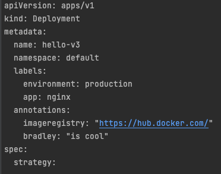

## What this is

This site is to hold documentation I make as I go along for Kubernetes manifests that I write, as well as possible values
for each field.

## How it works

As this site grows, more and more pages will get added to the left navigation bar.

They default to expanded, but if it's starting to become annoying, I can disable that feature.

At the top of the files, you will be introduced to what the file does. The example of `deployment` is below

On the right hand side navigation, it's designed to mirror a manifest file

| Navigation                                                                                    | Manifest file                   |
|-----------------------------------------------------------------------------------------------|---------------------------------|
|   |  |

Finally, there will be an example. This is the full file with all possible variations of the file that I have the time to create.
You won't be able to actually deploy it, as it's an example

This can be found under the example box at the top - With links to the relevant sections besides it

